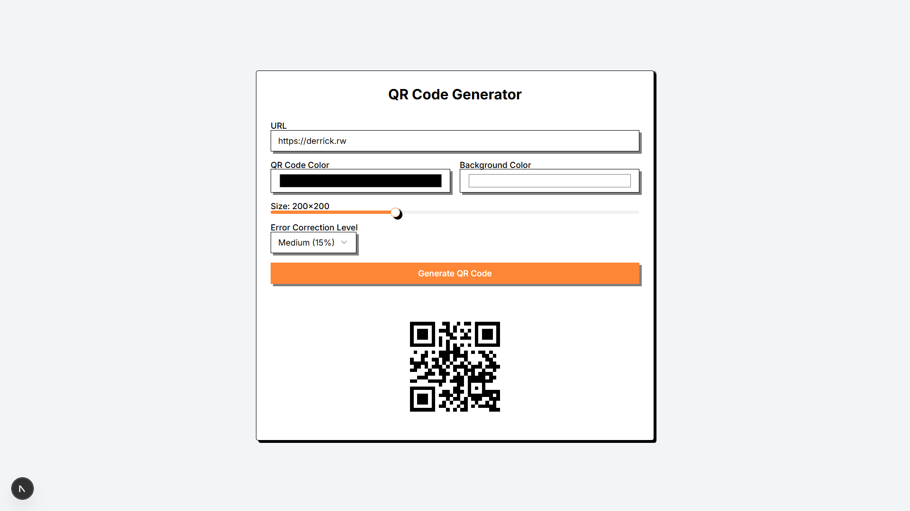

# QR Code Generator

A modern, customizable QR code generator built with Next.js 15 and React 19. Create beautiful QR codes with various customization options.



## Features

- Generate QR codes from any URL
- Customize QR code colors (foreground and background)
- Adjust QR code size with an interactive slider
- Select error correction level (Low, Medium, Quartile, High)
- Real-time QR code preview
- Responsive design for all device sizes
- Modern UI with shadcn/ui components

## Technologies Used

- **Next.js 15.3.2** with App Router
- **React 19.0.0**
- **TypeScript 5**
- **Tailwind CSS 4** for styling
- **qrcode.react 4.2.0** for QR code generation
- **shadcn/ui** components
- **Turbopack** for faster development builds

## Getting Started

### Prerequisites

- Node.js 20.x or later
- npm or pnpm or yarn

### Installation

1. Clone the repository:

   ```bash
   git clone https://github.com/derrick-nuby/qrcd.git
   cd qrcd
   ```

2. Install dependencies:

   ```bash
   npm install
   # or
   yarn install
   # or
   pnpm install
   ```

3. Start the development server:

   ```bash
   npm run dev
   # or
   yarn dev
   # or
   pnpm dev
   ```

4. Open [http://localhost:3000](http://localhost:3000) in your browser to see the application.

## Usage

1. Enter a URL in the input field
2. Customize the QR code appearance:
   - Change foreground and background colors
   - Adjust the size using the slider
   - Select an error correction level
3. Click "Generate QR Code"
4. Use the generated QR code for your needs (save, share, etc.)

## QR Code Error Correction Levels

- **Low (7%)**: Best for clean environments with minimal risk of damage
- **Medium (15%)**: Good balance between size and error correction
- **Quartile (25%)**: Better error correction for more reliable scanning
- **High (30%)**: Best error correction for harsh environments or small prints

## Development

### Scripts

- `npm run dev`: Start the development server with Turbopack
- `npm run build`: Build the application for production
- `npm start`: Start the production server
- `npm run lint`: Run ESLint to check code quality

## License

This project is licensed under the MIT License - see the LICENSE file for details.

## Acknowledgments

- [qrcode.react](https://github.com/zpao/qrcode.react) for the QR code generation library
- [shadcn/ui](https://ui.shadcn.com) for the beautiful UI components
- [Tailwind CSS](https://tailwindcss.com) for the utility-first CSS framework
